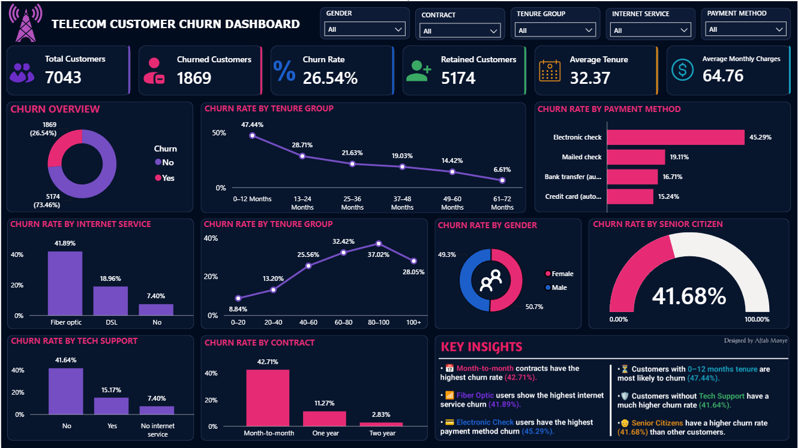

# 📊 Telecom Customer Churn Dashboard

An interactive **Power BI Dashboard** built to analyze customer churn patterns in the telecom industry. This project provides actionable business insights by identifying the key factors contributing to customer churn and helps support data-driven customer retention strategies.

---

## 📌 Project Overview

Customer churn is a critical challenge for telecom companies. This dashboard analyzes customer demographics, contract types, payment methods, internet services, tenure, and other factors to understand customer behavior and identify high-risk segments.

The dashboard is fully interactive with slicers and KPI cards, enabling users to explore churn trends efficiently.

---

## 🎯 Objectives

- Analyze customer churn behavior
- Identify high-risk customer segments
- Monitor overall churn performance
- Compare churn across multiple customer attributes
- Build an interactive business intelligence dashboard
- Support customer retention strategies

---

## 🛠 Tools & Technologies

- Power BI
- Power Query
- DAX
- Data Modeling
- Data Cleaning
- Data Visualization

---

## 📈 Dashboard KPIs

| KPI | Value |
|------|------:|
| Total Customers | 7,043 |
| Churned Customers | 1,869 |
| Retained Customers | 5,174 |
| Overall Churn Rate | 26.54% |
| Average Tenure | 32.37 Months |
| Average Monthly Charges | $64.76 |

---

## 📊 Dashboard Features

- Interactive KPI Cards
- Customer Churn Overview
- Churn Rate by Contract Type
- Churn Rate by Tenure Group
- Churn Rate by Payment Method
- Churn Rate by Internet Service
- Churn Rate by Tech Support
- Churn Rate by Gender
- Churn Rate by Senior Citizen
- Dynamic Filters for Data Exploration

---

## 🔍 Key Insights

- 📌 Month-to-Month contracts have the highest churn rate (**42.71%**).
- 📌 Customers with **0–12 months** tenure are most likely to churn (**47.44%**).
- 📌 Fiber Optic customers show the highest internet service churn (**41.89%**).
- 📌 Electronic Check users have the highest payment method churn (**45.29%**).
- 📌 Customers without Tech Support have significantly higher churn (**41.64%**).
- 📌 Senior Citizens experience a higher churn rate (**41.68%**).

---

## 📷 Dashboard Preview

> Add your dashboard screenshot here.



---

## 📂 Repository Structure

```
FUTURE_DS_02
│
├── Dashboard.pbix
├── Dashboard Preview.png
├── Telecom Customer Churn Dashboard.pdf
├── Telecom_Customer_Churn.csv
├── README.md
└── LICENSE
```

---

## 💼 Business Value

This dashboard enables organizations to:

- Improve customer retention
- Reduce churn
- Identify high-risk customers
- Optimize business decisions
- Understand customer behavior
- Support strategic planning through interactive analytics

---

## 👨‍💻 Author

**Aftab Monye**

🔗 LinkedIn: https://www.linkedin.com/in/aftab-monye/

💻 GitHub: https://github.com/aftabmonye

---

⭐ If you found this project useful, don't forget to **Star** the repository!
